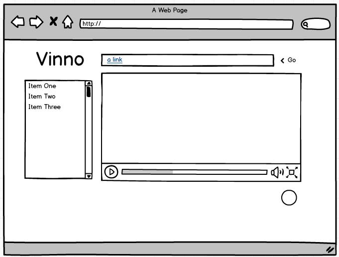

# VINNO-CLIW

VINNOO

Audio Annotation Tool

DESCRIERE

Se doreşte implementarea unui instrument Web (eventual, o extensie de navigator) pentru adnotarea conţinuturilor video redate utilizatorului. O adnotare poate include termeni de conţinut (tag-uri) sau poate avea ataşate resurse specifice: imagini, alte melodii, videoclip-uri, coordonate geografice, persoane ce au contribuit la acel conţinut (de exemplu, compozitor sau interpret) etc. Sistemul va putea realiza managementul tuturor adnotărilor specificate de un utilizator cu posibilitatea exportării acestora într-un format deschis (e.g., CSV, JSON, XML).

Specificatie

Pentru realizarea acestui proiect vom folosi API-urile de la GOOGLE si YOUTUBE.

Mockup

1

2

3

QOC 

Am ales Mockup-ul numarul 2. Am sa prezint mai jos principalele motive pentru care am ales acest design.

Am ales acest design deoarece este foarte simplist si usor de utilizat.

1. Din cele trei design-uri am ales aceasta varianta cu meniul in dreapta deoarece multi utilizatori sunt obisnuiti cu facebook-ul unde gasesc in dreapta chatul, iar la noi vor gasi lista cu adnotarile lor.
2. 

Cum face user-ul o cautare ? 
a. Pentru a cauta userul va folosi o bara de search din mijlocul ecranului.
Cum salveaza userul o cautare ? 
a. Va trebui adauga o iconita care ii permite sa salveze cautarea
Cum filtreaza userul cautarea pe un anumit tip de resurse ? 
a. Va trebui adaugat un filtru cu ajutorul caruia poate sa filtreze in timp real rezultatele.
Cum isi da seama userul de ce are de facut ? 
a. Ar trebuii adaugate niste informatii la prima utilizare a site-ului (cookie) 
b. Putem face un demo cu bootsrap tour.

Cum facem ca userul sa nu aiba probleme pe ecranele mai mici ?
a. Facem ca meniul sa poata fi inchis si deschis

Cum ne asiguram ca userul stie ce item din lista a selectat ?
a. Folosim un hover cu un blur pentru a evidentia item-ul selectat.
